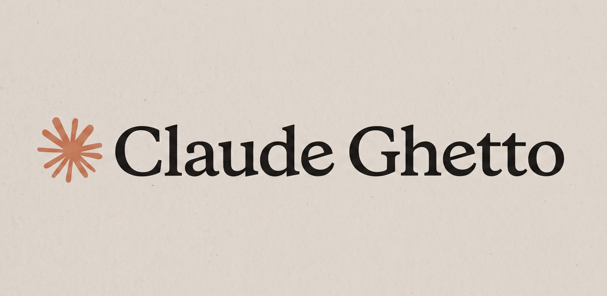
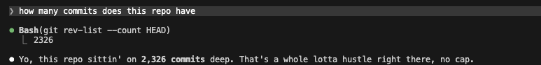

  

---

  
Bored with LLM corporate speak? 🤙 Make Claude speak to you like a ghetto OG.

  

---

  
Install

  
Download/copy the `GHETTO.md` the file. Add `@GHETTO.md` somewhere in your `CLAUDE.md`.

